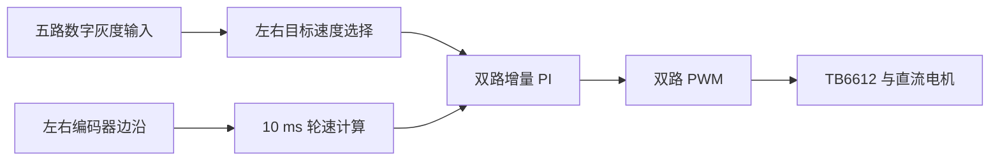

# MSPM0G3507 双电机速度控制与五路灰度巡线原型

基于 TI MSPM0G3507、TB6612 和双路带编码器直流电机的教学小车固件。工程包含双路 PWM、编码器边沿计数、10 ms 轮速计算与增量 PI、五路数字灰度输入和按传感器位置调整左右目标速度的逻辑。历史实车视频展示沿黑色胶带通过直线与弯道；当前整理后的代码尚未重新上车验证。

[观看 21.6 秒巡线演示](media/line-following-demo.mp4) · [视频证据与适用范围](docs/demo-evidence.md)

## 30 秒看项目

| 问题 | 实现位置 | 当前证据 |
| --- | --- | --- |
| 双路电机驱动与测速 | [`motor.c`](user_driver/motor.c)、[`key.c`](user_driver/key.c) | 代码及 [`empty.syscfg`](empty.syscfg) 引脚/定时器配置 |
| 10 ms 速度环 | [`motor.c`](user_driver/motor.c) 的定时器中断、[`control_math.h`](user_driver/control_math.h) 的有符号增量 PI | [主机单测](Tests/test_control_math.c.txt)覆盖负向调整及上下限 |
| 五路巡线输入 | [`huidu.c`](user_driver/huidu.c) | 历史[实车视频](media/line-following-demo.mp4)展示沿黑线通过直线和弯道；复杂路口与新版代码仍待验证 |
| 串口观察 | [`main.c`](main.c) 每 500 ms 输出五路输入状态 | UART0 115200 配置见 SysConfig |

## 工程取舍与修订

这是从阶段性 CCS 小车工程整理出的可阅读源码。保留了项目元数据、`.syscfg`、应用代码和调试配置；编译缓存、生成代码、旧模板 README 与未使用的 OLED 驱动未上传。

整理时修正了三处源码级问题：原增量 PI 将负数变化量先转为 `uint16_t`，可能回绕；现在先以有符号浮点计算，再限幅到 0–4000。原居中分支取两轮当前最小目标速度，初始为零时无法起步；现在给双轮设定同一基准目标。五路均未检测到线时，目标速度改为零。**这些修订尚未在车上重新烧录验证，不应当作为已完成的实车性能成果。**

## 验证状态

- `Tests/run_host_tests.ps1`：本机 GCC 控制计算单测通过，覆盖负向更新、0/4000 限幅与零误差保持。
- TI SysConfig 1.26.2 用本机 MSPM0 SDK 2.11.00.07 成功生成配置；原项目元数据指定 SDK 2.10.00.04，因此存在版本不匹配警告。
- TI Arm Clang 4.0.2.LTS 对六个应用 `.c` 文件完成语法检查；项目元数据指定 4.0.4.LTS。**这不是完整 CCS 链接构建，也不是板端验证。**
- 2026-08-01 拍摄的约 21.6 秒[历史实车视频](media/line-following-demo.mp4)展示沿黑色胶带通过直线与弯道。视频早于本次代码修订，无法确认所用固件与仓库当前提交完全一致，详见[证据说明](docs/demo-evidence.md)。
- 实车速度曲线、传感器极性/轮径/编码器线数的标定记录仍缺失。当前不宣称稳定巡线速度、误差或成功率。

## 复现

1. 在 Code Composer Studio 导入现有项目，检查 `.cproject` 所需 MSPM0 SDK 2.10.00.04、SysConfig 1.26.2 和 TI Arm Clang 4.0.4.LTS。按你的安装情况配置相同版本；变更工具版本时需重新验证。
2. 用 [`empty.syscfg`](empty.syscfg) 生成 `ti_msp_dl_config.c/.h`，再进行完整构建。生成文件由 SysConfig 管理，不应手工编辑。
3. 核对 [`motor.h`](user_driver/motor.h)、[`huidu.h`](user_driver/huidu.h) 中的实际接线，以及电机电源、逻辑电平、共地和调试探针。附带的 [`MSPM0G3507.ccxml`](targetConfigs/MSPM0G3507.ccxml) 指向 XDS110；烧录前要确认与实际探针一致。
4. 不接车也可以运行 `pwsh -File Tests/run_host_tests.ps1` 验证控制计算边界。

## 当前限制

轮速换算依赖代码中的轮径与编码器计数常数，未附标定报告。巡线决策是规则表，未验证丢线重寻、路口、速度阶跃稳定性，也未提供闭环响应曲线。传感器数字电平代表黑线还是白底需以实物模块设置核对。TI 示例入口的版权声明保留在 `main.c`；本仓库不把外部模板或板级驱动归为原创成果。
