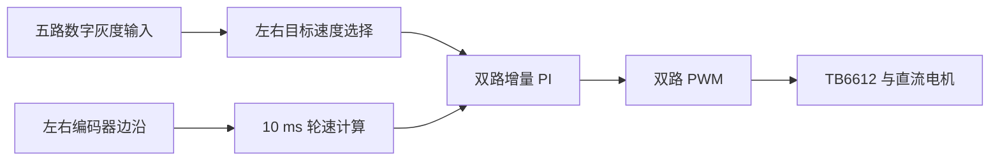

# MSPM0G3507 巡线小车｜双电机速度环与五路灰度控制

基于 TI MSPM0G3507、TB6612 和双路带编码器电机，实现 10 ms 双电机速度环与五路灰度差速巡线。同一黑色胶带赛道实测 15 次，按“完整跑完且未脱线”计，15 次均成功（15/15）；附 21.6 秒实车演示。

[观看 21.6 秒巡线演示](media/line-following-demo.mp4) · [查看测试记录](docs/demo-evidence.md) · [查看控制代码](user_driver/motor.c)

## 实现与证据

| 问题 | 实现位置 | 当前证据 |
| --- | --- | --- |
| 双路电机驱动与测速 | [`motor.c`](user_driver/motor.c)、[`key.c`](user_driver/key.c) | 代码及 [`empty.syscfg`](empty.syscfg) 引脚/定时器配置 |
| 10 ms 速度环 | [`motor.c`](user_driver/motor.c) 的定时器中断、[`control_math.h`](user_driver/control_math.h) 的有符号增量 PI | [主机单测](Tests/test_control_math.c.txt)覆盖负向调整及上下限 |
| 五路巡线输入 | [`huidu.c`](user_driver/huidu.c) | [实车视频](media/line-following-demo.mp4)展示沿黑线通过直线和弯道；同一赛道测试 15/15 次完成 |
| 串口观察 | [`main.c`](main.c) 每 500 ms 输出五路输入状态 | UART0 115200 配置见 SysConfig |

## 代码整理与改进

从 CCS 小车工程整理出项目元数据、`.syscfg`、应用代码和调试配置，并按电机、编码器、灰度输入与串口模块组织源码。

针对增量 PI 的负向调整增加有符号计算和 0–4000 限幅；居中时设置双轮基准目标速度，丢线时将目标速度设为零。[控制计算单测](Tests/test_control_math.c.txt)覆盖占空比更新与上下限。演示视频使用整理前的原始工程代码，当前仓库包含上述改进。

## 实测与测试

- **实车巡线**：同一条黑色胶带赛道测试 15 次，完整跑完且未脱线 15 次；[视频](media/line-following-demo.mp4)展示直线与弯道运行。
- **控制计算**：`pwsh -File Tests/run_host_tests.ps1` 通过，覆盖负向调整、0/4000 限幅与零误差保持。
- **工程检查**：SysConfig 1.26.2 生成配置；TI Arm Clang 对六个应用 `.c` 文件完成语法检查。

## 复现

1. 在 Code Composer Studio 导入现有项目。`.cproject` 配置 MSPM0 SDK 2.10.00.04、SysConfig 1.26.2 和 TI Arm Clang 4.0.4.LTS。
2. 用 [`empty.syscfg`](empty.syscfg) 生成 `ti_msp_dl_config.c/.h`，再进行完整构建。生成文件由 SysConfig 管理，不应手工编辑。
3. 核对 [`motor.h`](user_driver/motor.h)、[`huidu.h`](user_driver/huidu.h) 中的实际接线，以及电机电源、逻辑电平、共地和调试探针。附带的 [`MSPM0G3507.ccxml`](targetConfigs/MSPM0G3507.ccxml) 指向 XDS110；烧录前要确认与实际探针一致。
4. 运行 `pwsh -File Tests/run_host_tests.ps1` 验证控制计算。

TI 示例入口的版权声明保留在 `main.c`。
